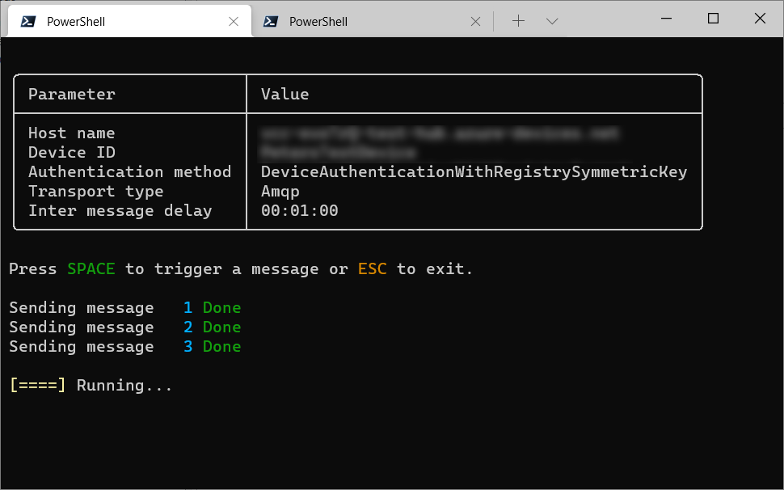

# Azure IoT hub client

Have you ever felt the need to test an IoT Hub connection? This is a simple console program allows you to send messages to an Azure IoT Hub. It is based on [Microsoft.Azure.Devices.Client](https://www.nuget.org/packages/Microsoft.Azure.Devices.Client).

## How do I get it?

You can download the tool from the [Releases](/releases) or download the source code and run `dotnet build`.

## How do I use it?

1. [Create a IoT Device and get it's connection string](https://docs.microsoft.com/en-us/azure/iot-hub/iot-hub-create-through-portal#register-a-new-device-in-the-iot-hub)

1. Run the `IotHubClient.exe` with the devices connection string
    ```powershell
    .\IotHubClient.exe "HostName=test-hub.azure-devices.net;DeviceId=TestDevice;SharedAccessKey=AAAAAAAAAAAAAAAAAAAAAAAAAAAAAAAAAAAAAAAAAAA="
    ```

That's it. The program will run and send one message every minute (by default) or whenever you hit the space key.



It will send UTF8 encoded JSON messages like
```JSON
{
    "MessageNo": 1,
    "TimeStamp": "2021-05-07T15:13:05.9449714+02:00",
    "MachineName": "My-PC"
}
```

## How do I configure it?

Use `--help` to see configuration options:
```powershell
> .\IotHubClient.exe --help
USAGE:
    IotHubClient.dll [connectionString] [OPTIONS]

ARGUMENTS:
    [connectionString]    Azure IoT device connection string as presented in the Azure portal

OPTIONS:
    -h, --help             Prints help information
    -t, --transportType    TransportType used by the library.
                           Supported: Amqp, Http1, Amqp_WebSocket_Only, Amqp_Tcp_Only, Mqtt, Mqtt_WebSocket_Only, Mqtt_Tcp_Only
    -d, --delay            Delay between consecutive messages

```